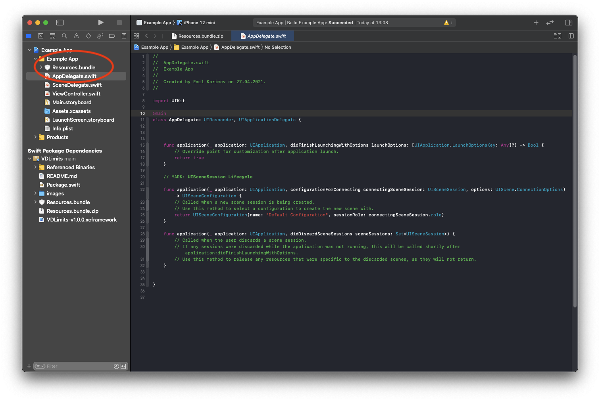

# Vsegda.da SDK

## 1. Требования для работы с VDLimits

Минимальная версия iOS 12 и выше.

Добавьте в info.plist запросы на доступ к камере и фотоальбому:

- Privacy - Camera Usage Description (photo/videos)
- Privacy - Photo Library Usage Description (library)

```xml
<key>NSCameraUsageDescription</key>
<string>yourWording</string>
<key>NSPhotoLibraryUsageDescription</key>
<string>yourWording</string>
```

# 2. Добавьте Vsegda.da SDK в ваш проект

### - Ручная установка

1. Копируем "VDLimits.xcframework" к свой проект.
2. Переходим в основные настройки таргета, и там где "Frameworks, Libraries, Embedded Content", добавляем фреймворк нажатием на "+".
 
 
3. В появившемся окне нажимаем на "Add Other..." и "Add Files...".


4. Выбераем "VDLimits.xcframework" и нажимаем на кнопку "Open".

 
5. Вот так должно получиться у вас.


6. Загружаем, распаковываем и копируем Resources.bundle к себе в проект по ссылке https://raw.githubusercontent.com/RusLab/VDLimit_iOS/main/Resources.bundle.zip


### - Установка через SPM

1. Добавляем Package в свой проект https://github.com/RusLab/VDLimit_iOS.git

2. Устанавливаем минимальную версию или выбираем конкретную

3. Выбераем таргет к которому слинковать библиотеку и нажимаем "Finish"

4. Загружаем, распаковываем и копируем Resources.bundle к себе в проект по ссылке https://raw.githubusercontent.com/RusLab/VDLimit_iOS/main/Resources.bundle.zip


# 3. Инициализируйте библиотеку Vsegda.da

получить одобрение: отчество - Одобреевич

```swift
import VDLimits

class ViewController: UIViewController {

private var vdlimits: VDLimits!

...
let config = VDLimits.Config(apiKey: "your vsegda da api key",
                            apiSecret: "your vsegda da api secret",
                            userNumber: "9999999999",
                            userId: "some user id")
vdlimits = VDLimits(with: config, delegate: self)
...

}
```

#### Подпишитесь на протокол: VDLimitsProtocol

```swift

extension ViewController: VDLimitsProtocol {
        
    func vdLimitsResult(_ response: VDResponse) {
        
    }

    func vdLimitsError(message error: String) {
        
    }
    
    func vdLimitsDismiss(from: VDResult) {
        
    }
}
```


```swift
public enum VDResponse {
    case approved(limit: Double, expiration: String)
    case rejected
    case waiting
}

public enum VDResult {
    case approved
    case rejected
    case waiting
}
```

# 4. Проверка Кредитного лимита без отображения UI

```swift
vdlimits.start()
```

# 5. Запуск экрана для оформления заявки на кредитный лимит.

```swift
let navController = // ваш контроллер
vdlimits.start(with: navController)
```

# 6. Опционально вы можете изменить UI.

Изменение цветовой схемы:

```swift
public var primaryBackgroundColor: UIColor
public var secondaryBackgroundColor: UIColor
public var primaryForegroundColor: UIColor
public var secondaryForegroundColor: UIColor
public var accentColor: UIColor
public var errorColor: UIColor
```

Изменение шрифтов (При назначении шрифтов используется только его семейство, размеры не учитываются):

```swift
public var fontRegular: UIFont
public var fontMedium: UIFont
public var fontSemiBold: UIFont
public var fontBold: UIFont
```

Пример:

```swift
VDTheme.defaultTheme.accentColor = UIColor.init { (trait) -> UIColor in
    return trait.userInterfaceStyle == .dark ? UIColor.green : UIColor.blue
}            
```
